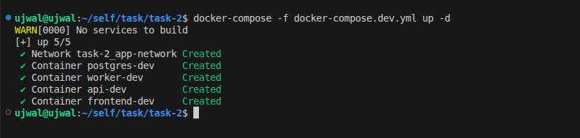
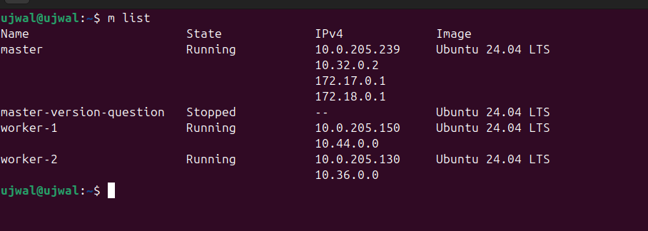
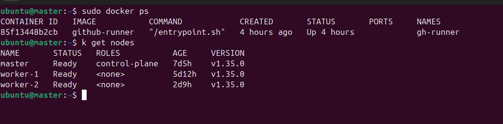
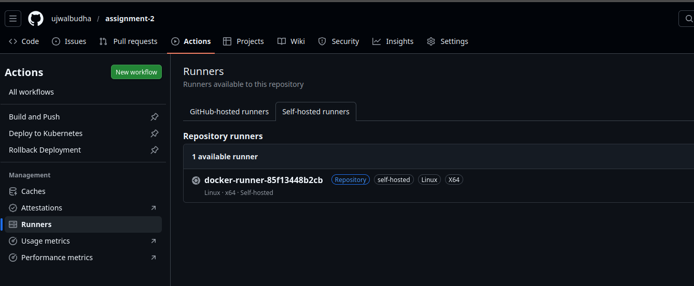
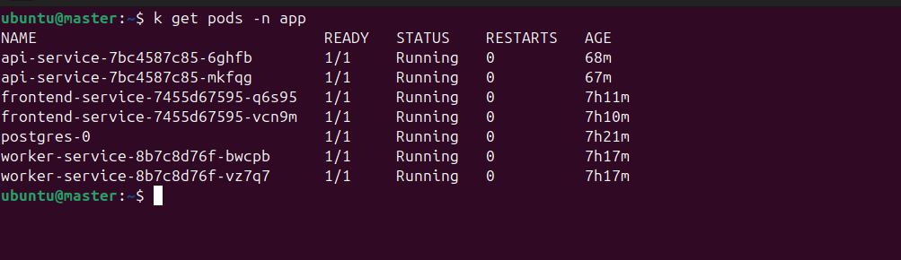
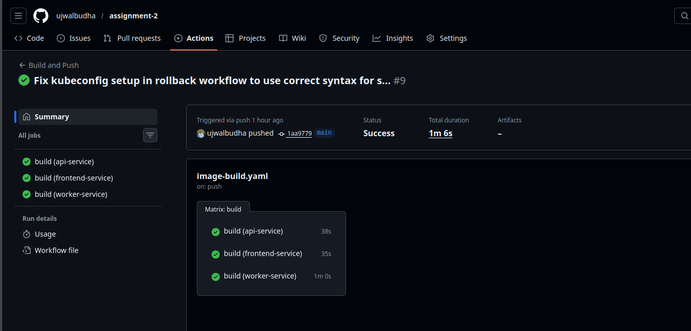
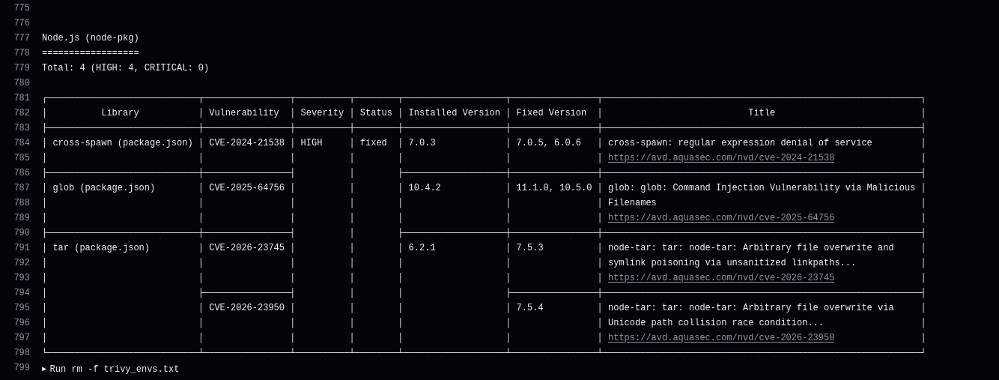
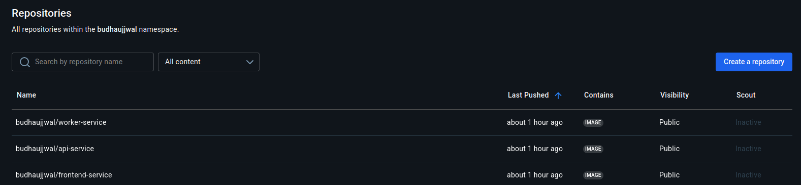

# assignment-2

Microservices application with CI/CD and Kubernetes deployment.

## Architecture

- **api-service** - Node.js REST API
- **worker-service** - Python background worker
- **frontend-service** - React app served via Nginx
- **postgres** - Shared database

---

## Local Setup

```bash
docker-compose -f docker-compose.dev.yml up --build
```

| Service  | URL                  |
|----------|----------------------|
| Frontend | http://localhost:3001 |
| API      | http://localhost:3000 |
| Postgres | localhost:5432       |


*docker-compose: All services running locally*

---

## Kubernetes Deployment

### Current Approach

- **Cluster**: kubeadm with 1 master + 2 worker nodes on Multipass VMs
- **CI/CD**: GitHub Actions with self-hosted runner (Docker container on master node)
- **Deployment**: Kustomize via `kubectl apply -k k8s/`

### Infrastructure

```
┌─────────────────────────────────────────────────────────────┐
│                     Multipass VMs                           │
├───────────────────┬───────────────────┬─────────────────────┤
│   Master Node     │   Worker Node 1   │   Worker Node 2     │
│  ┌─────────────┐  │  ┌─────────────┐  │  ┌─────────────┐    │
│  │ GitHub      │  │  │ App Pods    │  │  │ App Pods    │    │
│  │ Runner      │  │  └─────────────┘  │  └─────────────┘    │
│  │ (container) │  │                   │                     │
│  └─────────────┘  │                   │                     │
│  kubeconfig       │                   │                     │
└───────────────────┴───────────────────┴─────────────────────┘
```

The self-hosted runner runs as a Docker container on the master node with access to the cluster's kubeconfig. When the deploy workflow triggers, it uses `kubectl apply -k k8s/` to deploy all manifests.


*multipass-vm-list: VMs running for the cluster*


*custom-runner-k8s-nodes: Runner container with kubectl access to cluster nodes*

### K8s Resources

```
k8s/
├── namespace.yaml          
├── configmap.yaml          
├── secrets.yaml            
├── network-policy.yaml     
├── ingress.yaml            
├── kustomization.yaml      
├── api-service/
│   ├── deployment.yaml     
│   ├── service.yaml        
│   └── hpa.yaml            
├── frontend-service/
│   ├── deployment.yaml    
│   ├── service.yaml       
│   └── hpa.yaml           
├── worker-service/
│   ├── deployment.yaml     
│   └── hpa.yaml            
└── postgres/
    ├── pv.yaml
    ├── pvc.yaml            
    ├── init-configmap.yaml 
    ├── statefulset.yaml   
    └── service.yaml       
```

### GitHub Secrets Required

| Secret | Description |
|--------|-------------|
| `DOCKERHUB_USERNAME` | Docker Hub username |
| `DOCKERHUB_TOKEN` | Docker Hub access token |
| `KUBECONFIG` | Base64 encoded kubeconfig (`cat ~/.kube/config \| base64 -w 0`) |


*self-hosted-runner: Runner registered in GitHub Actions*


*k8s-pods-deployed: All pods running in app namespace*


*deployment-rollout-status: Successful rollout of deployments*

### Alternative: MicroK8s (Single Node)

For a simpler local setup:

```bash
# Install microk8s
sudo snap install microk8s --classic
sudo usermod -aG microk8s $USER
newgrp microk8s

# Enable required addons
microk8s enable dns storage ingress

# Create data directory for postgres PV
sudo mkdir -p /data/postgres

# Deploy
microk8s kubectl apply -k k8s/

# Check status
microk8s kubectl get pods -n app
```

---

## CI/CD Pipeline

### Workflows

| Workflow | Trigger | Runner | Action |
|----------|---------|--------|--------|
| `image-build.yaml` | Push to main | `ubuntu-latest` | Build & push images to Docker Hub |
| `k8s-deploy.yaml` | Manual | `self-hosted` | Deploy to cluster via kustomize |
| `k8s-rollback.yaml` | Manual | `self-hosted` | Rollback to previous revision |

### Pipeline Flow

```
Push to main
     │
     ▼
┌─────────────────┐    ┌─────────────────┐    ┌─────────────────┐
│ Build Images    │───▶│ Push to Docker  │───▶│ Trivy Scan      │
│ (parallel)      │    │ Hub             │    │ (non-blocking)  │
└─────────────────┘    └─────────────────┘    └─────────────────┘
        │
        │ 
        ▼

Manual Trigger (k8s-deploy)
     │
     ▼
┌─────────────────┐    ┌─────────────────┐    ┌─────────────────┐
│ Self-hosted     │───▶│ kubectl apply   │───▶│ Wait for        │
│ Runner          │    │ -k k8s/         │    │ rollout (5min)  │
└─────────────────┘    └─────────────────┘    └─────────────────┘

Manual Trigger (k8s-rollback)
     │
     ▼
┌─────────────────┐    ┌─────────────────┐    ┌─────────────────┐
│ Select Service  │───▶│ kubectl rollout │───▶│ Wait for        │
│ (dropdown)      │    │ undo            │    │ rollout (5min)  │
└─────────────────┘    └─────────────────┘    └─────────────────┘
```


*matrix-pipeline-build: Parallel build of all 3 services*


*trivy-scan: Vulnerability scan results*

- note: since this is not a production so we are not flagging this high CVE score and stopping the pipeline for this usecase 


*dockerhub: Images pushed to Docker Hub registry*

---

## Database

### Persistence Strategy

- **StatefulSet** for stable pod identity
- **PersistentVolume** (5Gi) with `hostPath` at `/data/postgres`
- **PersistentVolumeClaim** bound to PV with `manual` storage class
- **Retain** reclaim policy to prevent data loss

### Troubleshooting

**Pod stuck in Pending:**
```bash
kubectl describe pod postgres-0 -n app
kubectl get pv,pvc -n app
```
check the events based on that look for further steps
check for pv, pvc for any binding related issues also verify if pv exist and the labels match

**Connection refused:**
```bash
kubectl logs postgres-0 -n app
kubectl get svc postgres -n app
```
Check if postgres is ready and service endpoints exist.

**Database not initialized:**
```bash
kubectl exec -it postgres-0 -n app -- psql -U postgres -d appdb -c "\dt"
```
If tables are missing, check the init-configmap is actually mounted correctly or not

**Performance issues:**
```bash
# Check resource usage
kubectl top pod postgres-0 -n app

# Check slow queries (connect to postgres)
kubectl exec -it postgres-0 -n app -- psql -U postgres -d appdb -c "SELECT * FROM pg_stat_activity;"
```
Increase resource limits in statefulset if needed.

**Reset database:**
```bash
kubectl delete pvc postgres-pvc -n app
kubectl delete pv postgres-pv
# Recreate PV/PVC and redeploy
kubectl apply -k k8s/
```

---

## Intentional tradeoffs

- for this assignment i have opt not to choose image tagging strategy and only used latest tag this will be implemented in the other assignment 
- No branching strategy only main branch used (assignment purpose only)

